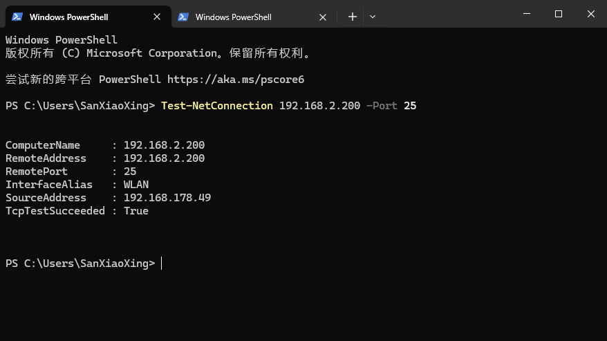
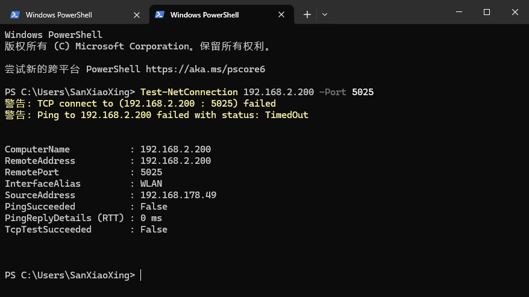

# ISSUE记录

## 上位机测试程序退出时显示错误信息 {#1}

[:material-tag: **Socket**](tags_category.md#1)
!!! Success "已解决"

    === "问题记录"

        - 在程序退出时，接收线程可能还在运行，而socket已经被关闭，导致线程中出现异常
        - 线程资源没有正确释放，可能导致资源泄漏

    === "解决方案"

        1. TCPClient.close() 方法 ：
            - 添加了线程等待逻辑，使用 join(timeout=2.0) 等待接收线程完全结束
            - 在关闭socket之前确保线程已停止
            - 将线程引用设置为 None ，确保资源完全释放

        2. UpperXMLTester.close() 方法 ：
            - 同样添加了线程等待逻辑
            - 确保在关闭默认连接之前，接收线程已经完全停止
            - 避免了线程仍在运行时关闭socket导致的异常

    === "修复效果"

        - 确保所有网络连接和线程资源都能正确释放


## 在线设备刷新显示错误问题 {#2}

[:material-tag: **重载**](tags_category.md#_2)

!!! Success "已解决"

    === "问题记录"

        - 当进行在线设备排序选择后，再次刷新会导致数据未全部更新

    === "解决方案"

        在refresh_table方法中，表格数据是基于device_map构建的，但是在刷新时没有清空表格的排序状态。当用户点击IP列排序后，表格会保持排序状态，但refresh_table方法重新设置行数时会破坏排序，导致数据重复显示

        ```
        在 `NetManager.py` 的 `refresh_table` 方法中添加了以下逻辑：
            1. 清空表格内容 ：使用 clearContents() 清除所有现有数据
            2. 重置排序状态 ：在数据填充前禁用排序 setSortingEnabled(False)
            3. 重新启用排序 ：数据填充完成后重新启用排序功能 setSortingEnabled(True)
        ```

    === "修复效果"

        - 刷新数据时，能够正常进行数据的刷新


## 上下位机测试直接使用IP设备问题 {#3}

!!! Warning "未解决"

    === "问题记录"
        - 上下位机测试设备中含有机箱以及IP设备时，直接使用IP设备进行测试时，下位机对设备直接进行控制，则会无法对IP设备直接控制
        - 多参数使用 IP 设备时可能会出现`'CardData' object has no attribute 'voltage'`等参数属性问题。

    === "解决方案"
        - 不在下位机进行IP设备进行执行控制
        - 在 XML 文件中直接使用`device`进行设备的区分，可直接进行设备的控制以及参数的传入

    === "解决效果"
        - 通过 XML 文件配置，在上位机中直接对IP设备进行控制，并且执行任务

## 未连接网线但是可以socket连接成功问题 {#4}

[:material-tag: **Socket**](tags_category.md#_1)
!!! Success "已解决"
    
    === "问题记录"
        - 编写上下位机设备测试用例时，测试DC电源发现此设备未连接也可以进行socket连接服务
        - 理论上未连接设备以及 Ping IP设备均显示不能连接

        源代码如下：

        

    === "解决方案"
        1. 尝试发送一个简单的命令来验证连接（简单判断）
        
        

        2. 更改端口号（完全解决）
            端口 25（SMTP 邮件端口）,很多杀毒软件/安全套件/VPN/邮件代理会拦截或代理本机到 25 端口的连接，即使没有插网线也会让 connect 看起来成功（连接到了本机的代理/驱动层，而不是目标设备）。这会造成你这台机器“能连”，而其他电脑（没有这些拦截/代理）会按预期失败。

    === "解决效果"
        连接超时，完全解决问题

        测试方法：

        用系统命令测试端口连通性，使用powershell发送命令

        === "端口测试 25"

        

        === "端口测试 5025"
        